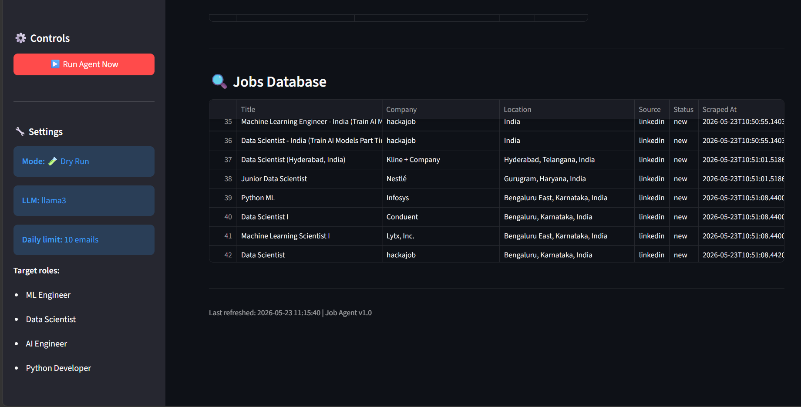
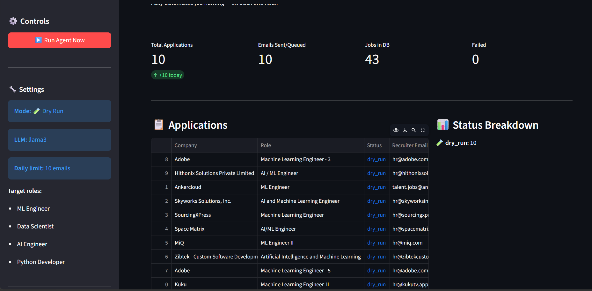

# 🤖 Job Application Agent

> An autonomous AI-powered job hunting system that discovers jobs, tailors resumes, finds recruiter contacts, generates personalized outreach emails, and automates applications — all with minimal human intervention.

---

# 📸 Results

## Job Discovery Results

```md id="sq17g6"

```

---

## Dashboard Preview

```md id="65s6it"

```

---

# ✨ Overview

The **Job Application Agent** is an end-to-end AI automation system designed to streamline and scale the job application process.

Instead of manually searching job boards, editing resumes, writing cold emails, and tracking applications, the agent automates the entire workflow using:

* Local LLMs via [Ollama](https://ollama.com?utm_source=chatgpt.com)
* Workflow orchestration with [LangGraph](https://www.langchain.com/langgraph?utm_source=chatgpt.com)
* AI pipelines powered by [LangChain](https://www.langchain.com?utm_source=chatgpt.com)
* Dashboard monitoring using [Streamlit](https://streamlit.io?utm_source=chatgpt.com)

---

# 🧠 System Workflow

```text id="2c4tr9"
Every day at 9 AM (automated)
            ↓
1. Scrape LinkedIn + Naukri + Internshala
            ↓
2. Score jobs using semantic matching
            ↓
3. Find recruiter names + emails
            ↓
4. Tailor resume to each job description
            ↓
5. Generate personalized cold emails
            ↓
6. Send applications via Gmail
            ↓
7. Log everything into dashboard/database
```

---

# 🚀 Features

## 🔍 Automated Job Discovery

* Scrapes:

  * LinkedIn
  * Naukri
  * Internshala
* Filters jobs based on:

  * role
  * skills
  * location
  * experience level

---

## 🧠 AI Resume Tailoring

Uses local LLMs through Ollama to:

* optimize resumes for ATS systems
* tailor experience to job descriptions
* improve keyword alignment
* dynamically generate role-specific resumes

---

## 📧 Personalized Cold Email Generation

Automatically writes:

* recruiter outreach emails
* referral requests
* application follow-ups

Each email is customized using:

* company context
* job description
* recruiter information
* user portfolio/resume

---

## 🕵️ Recruiter Discovery

Finds recruiter:

* names
* emails
* hiring contacts

using:

* web scraping
* company enrichment
* search heuristics

---

## 📊 Monitoring Dashboard

Built with Streamlit.

Tracks:

* applications sent
* failed attempts
* recruiter responses
* match scores
* daily activity
* logs and analytics

---

# 🏗️ Architecture

## High-Level Pipeline

```text id="m0z0bx"
Job Boards
    ↓
Scraper Engine
    ↓
Job Database
    ↓
Matching + Ranking Engine
    ↓
Resume Tailoring Agent
    ↓
Cold Email Generator
    ↓
Email Dispatcher
    ↓
Dashboard + Logs
```

---

# ⚡ Quick Start

# 1️⃣ Clone Repository

```bash id="0u9u1k"
git clone https://github.com/your-username/job-agent.git

cd job-agent
```

---

# 2️⃣ Create Virtual Environment

## Windows

```bash id="x5cw31"
python -m venv venv
venv\\Scripts\\activate
```

## macOS/Linux

```bash id="01dvgd"
python3 -m venv venv
source venv/bin/activate
```

---

# 3️⃣ Install Dependencies

```bash id="2fdrhq"
pip install -r requirements.txt
```

---

# 4️⃣ Install Ollama

Install Ollama from:

[Ollama Official Website](https://ollama.com?utm_source=chatgpt.com)

Then pull a model locally:

```bash id="l6hn0o"
ollama pull llama3
```

Run the Ollama server:

```bash id="jcx73v"
ollama serve
```

Default endpoint:

```text id="vz80ih"
http://localhost:11434
```

---

# 5️⃣ Configure Environment Variables

Create a `.env` file:

```env id="f1jwd6"
GMAIL_ADDRESS=your_email@gmail.com
GMAIL_APP_PASSWORD=your_app_password

JOB_TITLES=ML Engineer,Data Scientist
JOB_LOCATIONS=Bangalore,Remote

OLLAMA_HOST=http://localhost:11434

DRY_RUN=true
MAX_EMAILS_PER_DAY=10
```

---

# 6️⃣ Add Your Resume

Edit:

```text id="0jzhcx"
data/resumes/base_resume.txt
```

Replace the template with your real resume information.

The AI agent automatically tailors this resume for each application.

---

# 7️⃣ Test the System (Safe Mode)

```bash id="wx7s5m"
python main.py --dry
```

No real emails are sent.

---

# 8️⃣ Launch Production Mode

```bash id="0x9sz9"
python main.py --live
```

---

# 9️⃣ Start Dashboard

```bash id="3ikxjl"
python main.py --dashboard
```

Dashboard runs at:

```text id="fwk4gc"
http://localhost:8501
```

---

# 🔄 Automation Mode

Run continuously:

```bash id="u85t3d"
python main.py --daemon
```

The agent automatically executes daily workflows.

---

# 📁 Project Structure

```text id="52k8gw"
job-agent/
│
├── main.py
│
├── graph/
│   └── job_agent.py
│
├── tools/
│   ├── scraper.py
│   ├── resume_tailor.py
│   ├── recruiter_finder.py
│   └── email_sender.py
│
├── dashboard/
│   └── app.py
│
├── config/
│   └── settings.py
│
├── utils/
│   └── logger.py
│
├── data/
│   ├── resumes/
│   │   ├── base_resume.txt
│   │   └── tailored/
│   │
│   ├── jobs/
│   │   └── jobs.json
│   │
│   └── applications/
│
└── .github/workflows/
    └── run_agent.yml
```

---


# 🔐 Gmail App Password Setup

For security reasons, Gmail requires an **App Password** instead of your normal password.

Generate one here:

[Google App Passwords](https://myaccount.google.com/apppasswords?utm_source=chatgpt.com)

Steps:

1. Enable 2FA on your Google account
2. Create App Password
3. Use generated password in `.env`

---

# ☁️ GitHub Actions Automation

This project supports fully automated cloud execution using [GitHub Actions](https://github.com/features/actions?utm_source=chatgpt.com).

Add these repository secrets:

| Secret               | Description        |
| -------------------- | ------------------ |
| `GMAIL_ADDRESS`      | Gmail address      |
| `GMAIL_APP_PASSWORD` | Gmail app password |
| `OLLAMA_HOST`        | Ollama server URL  |
| `JOB_TITLES`         | Target job roles   |
| `JOB_LOCATIONS`      | Target locations   |

The workflow automatically runs every weekday at 9 AM IST.

---

# 🛡️ Safety Features

* `DRY_RUN=true` by default
* Maximum daily email limits
* Duplicate application prevention
* Structured logging
* Graceful recruiter lookup failure handling
* Company blacklisting support

---

# 📊 Dashboard Analytics

The Streamlit dashboard provides:

* Total applications
* Success/failure tracking
* Recruiter email database
* Daily outreach activity
* Job match scores
* Application logs
* Resume generation history

---

# 🧠 AI Stack

## LLM Runtime

* [Ollama](https://ollama.com?utm_source=chatgpt.com)

## Orchestration

* [LangGraph](https://www.langchain.com/langgraph?utm_source=chatgpt.com)

## AI Framework

* [LangChain](https://www.langchain.com?utm_source=chatgpt.com)

## Dashboard

* [Streamlit](https://streamlit.io?utm_source=chatgpt.com)

---

# 📈 Future Improvements

Potential upgrades:

* Multi-agent architecture
* AI interview preparation
* Resume ATS scoring
* LinkedIn auto-apply workflows
* AI-generated cover letters
* Recruiter sentiment analysis
* Telegram/Discord notifications
* Browser automation with Playwright
* Voice-based AI assistant

---

# 📜 License

MIT License

---

# ⚠️ Disclaimer

This project is intended for educational and personal productivity purposes only.

Users are responsible for complying with:

* LinkedIn Terms of Service
* Email outreach regulations
* Anti-spam policies
* Platform scraping limitations

Use responsibly.

---

# 🙌 Acknowledgements

Built using:

* [Ollama](https://ollama.com?utm_source=chatgpt.com)
* [LangChain](https://www.langchain.com?utm_source=chatgpt.com)
* [LangGraph](https://www.langchain.com/langgraph?utm_source=chatgpt.com)
* [Streamlit](https://streamlit.io?utm_source=chatgpt.com)
* [GitHub Actions](https://github.com/features/actions?utm_source=chatgpt.com)
