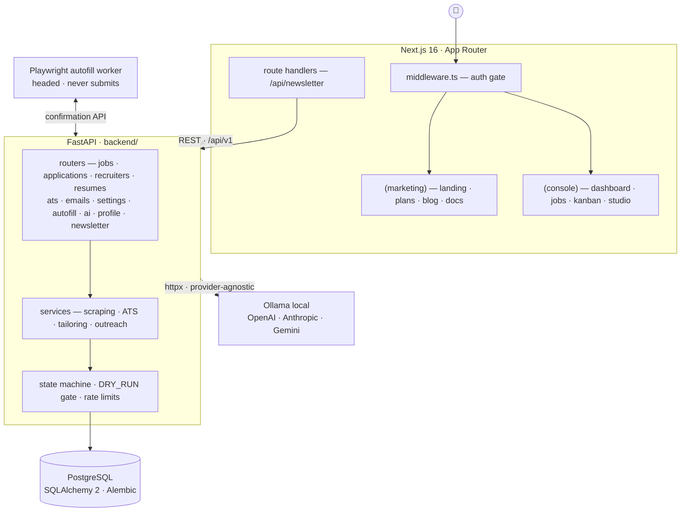
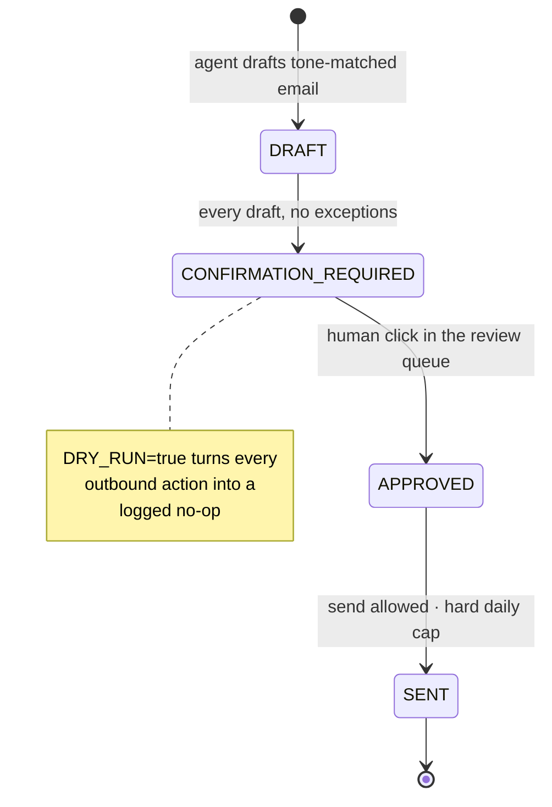

<div align="center">

# Job·Agent

**The AI career agent with a human holding the keys.**


Job·Agent discovers jobs, tailors your resume per role, finds recruiter contacts, drafts personalized outreach, and tracks every application — while a strict human-approval gate sits in front of every outbound action.

```text
DRY_RUN=true by default · zero auto-submits · nothing sends without your click
```

</div>

---

## Why it's different

Job agents fail when they act without permission. Job·Agent is architected so it **can't**:

- **Human-in-the-loop state machine** — every email halts at `CONFIRMATION_REQUIRED` until you approve it. The autofill worker never clicks a final submit button.
- **No fabrication, ever** — the LLM may reorder and rephrase your real experience. Skills whitelist, education and personal data are frozen server-side; hallucinated content is stripped before storage.
- **Local-first data** — your resumes, applications and contacts live in *your* PostgreSQL database. No third-party resume databases, no telemetry by default.
- **Rate-limited by design** — hard daily outreach cap (default 10), duplicate-application blocking at the database level.

## Architecture


```mermaid
flowchart TB
    U(("👤")) --> MW

    subgraph FE["Next.js 16 · App Router"]
        direction TB
        MW["middleware.ts — auth gate"]
        MKT["(marketing) — landing · plans · blog · docs"]
        CON["(console) — dashboard · jobs · kanban · studio"]
        RH["route handlers — /api/newsletter"]
    end

    MW --> MKT
    MW --> CON
    RH --> BE
    FE -->|"REST · /api/v1"| BE

    subgraph BE["FastAPI · backend/"]
        direction TB
        RT["routers — jobs · applications · recruiters · resumes<br/>ats · emails · settings · autofill · ai · profile · newsletter"]
        SV["services — scraping · ATS · tailoring · outreach"]
        GATE["state machine · DRY_RUN gate · rate limits"]
        RT --> SV --> GATE
    end

    GATE --> DB[("PostgreSQL<br/>SQLAlchemy 2 · Alembic")]
    BE -.->|"httpx · provider-agnostic"| LLM["Ollama local<br/>OpenAI · Anthropic · Gemini"]
    WK["Playwright autofill worker<br/>headed · never submits"] <-->|"confirmation API"| BE
```

- **Backend** — FastAPI, SQLAlchemy 2.0 async, PostgreSQL, Alembic migrations, slowapi rate limiting, gzip + security headers, optional Sentry.
- **Frontend** — Next.js (App Router) + React 19, Tailwind CSS v4, Auth.js v5 (Google + GitHub), react-three-fiber ambient 3D, token-based light/dark design system.
- **Worker** — Playwright autofill engine with explicit confirmation gates.
- **AI layer** — provider-agnostic via plain `httpx`: Ollama (local), OpenAI, Anthropic or Gemini. No SDK lock-in.

## Feature tour

| Area | What you get |
| --- | --- |
| Auth | Passwordless Google / GitHub OAuth (Auth.js v5); console routes gated by `middleware.ts` |
| Onboarding | Post-login wizard: career stage, target roles, locations, weekly goal → saved to `/profile` |
| Job discovery | LinkedIn, Indeed & Glassdoor aggregated via `python-jobspy` into one deduplicated feed |
| Resume Studio | Live ATS scoring (75–85% target band), keyword-gap analysis, per-role tailoring |
| Resume Builder | Build from scratch: 12 templates, live A4 preview, per-bullet AI improve, PDF export |
| Outreach | Tone-matched recruiter emails drafted in seconds, approval queue, daily caps |
| Pipeline | Saved → Applied → Assessment → Interview → Offer Kanban with a strict state machine |
| Autofill review | Playwright worker for Greenhouse/Lever forms, always human-reviewed, headed mode |
| Plans | Free / Pro (₹799) / Max (₹2,999) with feature comparison — selection stored locally, billing on the roadmap |
| Newsletter | Idempotent subscribe endpoint behind a Next.js route handler + site footer form |
| Design | Warm paper / warm charcoal tokens, Fraunces + Inter, first-class light & dark themes |
| Marketing site | Landing, pricing, blog, docs, about, contact, privacy & terms — sitemap, robots and OG image included |

## Safety model


```mermaid
stateDiagram-v2
    [*] --> DRAFT: agent drafts tone-matched email
    DRAFT --> CONFIRMATION_REQUIRED: every draft, no exceptions
    CONFIRMATION_REQUIRED --> APPROVED: human click in the review queue
    APPROVED --> SENT: send allowed · hard daily cap
    SENT --> [*]

    note right of CONFIRMATION_REQUIRED
        DRY_RUN=true turns every
        outbound action into a
        logged no-op
    end note
```

Autofill follows the same philosophy: headed browser → human confirmation → never clicks "submit".

Read more: [docs/SECURITY.md](docs/SECURITY.md)

## Quickstart

### 1. Backend

```bash
cp .env.example .env          # fill in DATABASE_URL, LLM keys (or use Ollama)
python -m venv .venv && source .venv/bin/activate   # Windows: .venv\Scripts\activate
pip install -r requirements.txt
alembic upgrade head
uvicorn app.main:app --reload --app-dir backend
```

Health check: `curl http://127.0.0.1:8000/health`

### 2. Frontend

```bash
cd frontend
cp .env.example .env.local    # add AUTH_SECRET + OAuth creds (see below)
npm ci
npm run dev                   # http://localhost:3000
```

### 3. Sign in

1. Generate a session secret: `openssl rand -base64 32` → `AUTH_SECRET`
2. Create Google / GitHub OAuth apps — **step-by-step: [docs/AUTHENTICATION.md](docs/AUTHENTICATION.md)**
3. Restart `npm run dev` → click **Get Started Free** → sign in with one click

> OAuth not configured yet? The app still runs — the login page shows a setup hint instead of dead buttons, and console routes stay open until you set `AUTH_ENFORCED=true`.

### 4. Docker (backend stack)

```bash
docker compose up --build     # postgres + backend (migrations auto-run) + worker
```

## Environment variables

Backend (root `.env`) — see `.env.example` for the full annotated list:

| Variable | Purpose |
| --- | --- |
| `DRY_RUN` | **Safety master switch.** Keep `true` until you've reviewed the workflow. |
| `DATABASE_URL` | PostgreSQL connection string (asyncpg) |
| `CORS_ORIGINS` | Allowed browser origins, comma-separated |
| `RATE_LIMIT_DEFAULT` | slowapi default, e.g. `120/minute` |
| `JOB_TITLES`, `JOB_LOCATIONS`, `SCRAPER_SITES` | Discovery run configuration |
| `LLM_PROVIDER` | `ollama` \| `openai` \| `anthropic` \| `gemini` |
| `MAX_EMAILS_PER_DAY` | Hard outreach cap (default 10) |
| `SENTRY_DSN` | Optional error tracking |

Frontend (`frontend/.env.local`):

| Variable | Purpose |
| --- | --- |
| `AUTH_SECRET` | Session encryption key (**required**) |
| `AUTH_GOOGLE_ID` / `AUTH_GOOGLE_SECRET` | Google OAuth credentials |
| `AUTH_GITHUB_ID` / `AUTH_GITHUB_SECRET` | GitHub OAuth credentials |
| `AUTH_ENFORCED` | Login required for the console — **default `true`**; `false` only for local dev |
| `NEXT_PUBLIC_API_URL` | Backend REST base (default `http://127.0.0.1:8000/api/v1`) |
| `NEXT_PUBLIC_SITE_URL` | Canonical site URL for SEO/sitemap/OG |

## API surface

All routes are mounted under `/api/v1` (interactive docs at `/docs` when the backend runs):

| Router | Endpoints | Purpose |
| --- | --- | --- |
| `/jobs` | `POST /scrape` · `GET` | Trigger discovery run; list deduplicated feed |
| `/applications` | `POST` · `GET` · `PATCH /{id}/status` · `POST /{id}/run-agent` | Pipeline records and agent runs |
| `/recruiters` | `GET` · `POST /find` | Recruiter contact discovery |
| `/resumes` | `GET /master` · `GET /application/{id}` · `POST /tailor` | Master + tailored resumes |
| `/ats` | `POST /check` | ATS scoring |
| `/emails` | `POST /draft` · `POST /{id}/approve` · `POST /{id}/send` | Human-gated outreach |
| `/settings` | `GET` · `PATCH` | Runtime settings (`dry_run`, caps) |
| `/autofill` | `POST /sessions` · `GET /confirmations/{id}` · `POST /confirmations/{id}/approve` | Worker sessions + confirmation gate |
| `/ai` | `POST /improve` | No-fabrication resume snippet rewrites |
| `/profile` | `GET` · `PUT` | Onboarding profile per account |
| `/newsletter` | `POST /subscribe` | Idempotent email opt-in |

## Documentation

| Doc | Contents |
| --- | --- |
| [docs/AUTHENTICATION.md](docs/AUTHENTICATION.md) | Google + GitHub OAuth setup, session secrets, route protection |
| [docs/DEPLOYMENT.md](docs/DEPLOYMENT.md) | Production deploy with Docker, Nginx/Caddy and **SSL (Let's Encrypt)** |
| [docs/SECURITY.md](docs/SECURITY.md) | Threat model, headers, rate limits, secrets handling, disclosure |
| In-app docs | `/docs` (product + safety model) and `/docs/api` (API reference) |

## Testing & CI

```bash
cd backend && pytest -q          # state machine, email caps, ATS, smoke
cd frontend && npm run lint && npm run build
```

GitHub Actions runs backend lint + tests, frontend lint + build, and Docker image builds on every push to `main`.

## Project structure

```
Job-Agent/
├─ backend/            FastAPI app, Alembic migrations, services, tests
│  ├─ app/api/         jobs, applications, recruiters, resumes, ats,
│  │                   emails, settings, autofill, ai, profile, newsletter
│  └─ alembic/         0001–0004 (schema, settings/drafts, subscribers, profiles)
├─ frontend/           Next.js App Router
│  ├─ app/(marketing)/ landing, plans, blog, docs, about, contact,
│  │                   privacy, terms (pill-nav layout, SEO-complete)
│  ├─ app/(console)/   dashboard, jobs, applications, resume-studio,
│  │                   resume-builder, recruiters, settings, onboarding,
│  │                   autofill-review (icon-rail app shell, auth required)
│  ├─ app/(auth)/      split-screen login
│  ├─ app/api/         Auth.js handler + newsletter proxy route
│  ├─ components/      builder, onboarding, theme, layout, auth, plans,
│  │                   resume, jobs, applications, recruiters, landing,
│  │                   three (R3F), ui kit
│  ├─ lib/             api client, backend status hook, site config,
│  │                   blog content, 12 resume templates
│  └─ middleware.ts    auth gating (AUTH_ENFORCED=true by default)
├─ docker-compose.yml  postgres + backend + worker
└─ docs/               authentication, deployment (SSL), security
```

## Roadmap

- [ ] Stripe billing for Pro/Max tiers (plan selection is currently stored locally)
- [ ] Email digest of overnight discovery runs
- [ ] Resume version diffing UI
- [ ] Multi-user hosted mode with workspace isolation
- [ ] Calendar-aware follow-up nudges

## Contributing

PRs welcome — please run the linters and tests first, and read [docs/SECURITY.md](docs/SECURITY.md) before touching anything outbound-facing. Any change that weakens the human-approval gates will be rejected.

## License

Copyright © 2026 Ishank. All rights reserved. The software is provided "as is" — you are responsible for how you use automation, and for complying with the terms of the platforms you interact with.
